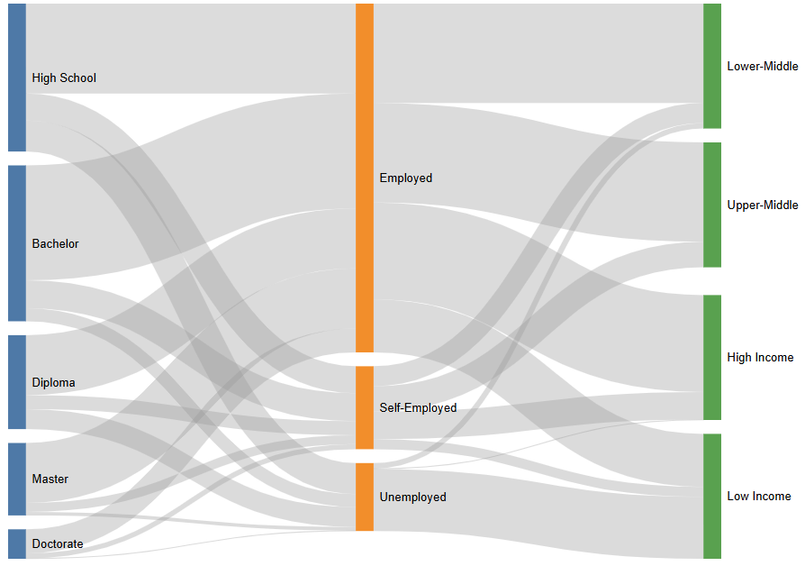
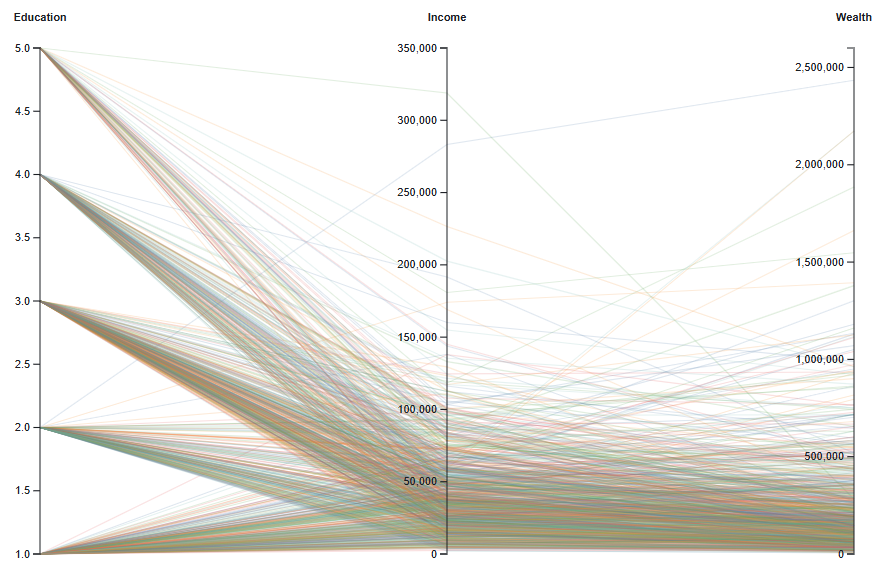
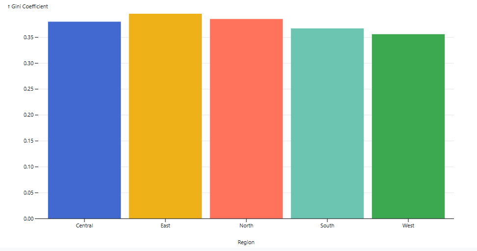

# Economic Inequality Analysis — Income & Wealth

### SkilledScore — Data Visualization Internship
**Task 3: Economic Inequality Comparative Visualization**

**Intern:** Usman Ali  
**Supervisor:** Dr. Zeeshan Usmani  

---

## 🔗 Live Interactive Project

### [View Interactive Analysis on Observable](https://observablehq.com/d/df002d87efbb0d65)

---

## 📊 Project Overview

This project was completed as **Task 3 of the SkilledScore Data Visualization Internship** under the supervision of **Dr. Zeeshan Usmani**.

The project explores economic inequality using a synthetic dataset of **1,000 individuals across five regions**. It examines relationships between income, wealth, education, employment status, and geographic region through comparative and interactive visualizations.

The objective is to transform multidimensional economic data into clear visual insights that help identify patterns of economic disparity.

---

## 🎯 Project Objectives

- Analyze income and wealth disparities across regions.
- Examine relationships between education, employment, and income.
- Compare regional levels of income inequality.
- Develop interactive and comparative visualizations.
- Communicate complex economic patterns clearly and effectively.

---

## 📁 Dataset

The project uses **synthetic economic data for 1,000 individuals across five regions**.

Key variables include:

- ID
- Region
- Income
- Wealth
- Education Level
- Employment Status
- Normalized Income
- Normalized Wealth
- Education Code
- Employment Code
- Region Code
- Income Bracket

> **Note:** The dataset is synthetic and was created specifically for analytical and visualization purposes.

---

## 🔄 Data Preparation

Data generation and preprocessing were completed in **Python using Jupyter Notebook**.

The preparation workflow included:

- Generating synthetic economic records.
- Structuring demographic and economic variables.
- Creating income brackets.
- Normalizing income and wealth.
- Encoding categorical variables.
- Preparing processed datasets for visualization and analysis.

The complete preparation workflow is available in:

`01_economic_inequality_data_preparation.ipynb`

---

## 📈 Key Visualizations

### 1. Sankey Diagram
Visualizes the flow from **Education Level → Employment Status → Income Bracket**.



### 2. Parallel Coordinates
Compares **education, income, and wealth** across regions and highlights multidimensional economic patterns.



### 3. Regional Gini Coefficient
Compares **income inequality across the five regions** using the Gini coefficient.



### 4. Interactive Regional Analysis
Interactive filtering enables deeper exploration of regional economic disparities.

🔗 **[Explore the Full Interactive Analysis on Observable](https://observablehq.com/d/df002d87efbb0d65)**


## 🔍 Analytical Focus

The project investigates:

- Income-to-education disparities.
- Employment barriers across education levels.
- Regional differences in income and wealth.
- Income inequality using Gini coefficients.
- Relationships between education, employment, income, and wealth.
- Potential interventions for reducing economic disparities.

---

## 🛠️ Tools & Technologies

- **Python**
- **Jupyter Notebook**
- **Pandas**
- **D3.js**
- **Observable**
- **JavaScript**
- **Data Visualization**
- **Statistical Analysis**

---

## 📂 Repository Structure

```text
economic-inequality-data-visualization/
│
├── data/
│   └── Project CSV datasets
│
├── 01_economic_inequality_data_preparation.ipynb
│
├── Economic_Inequality_Analysis_Presentation.pptx
│
├── economic-inequality-visualization-demo.mp4
│
└── README.md
